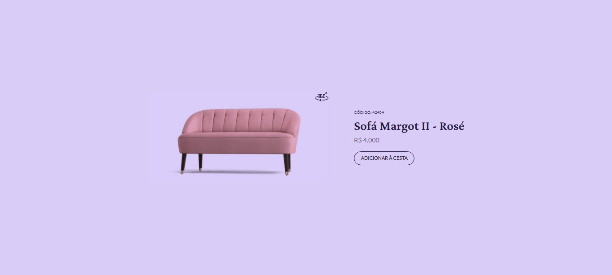

<h1 align="center"> Product Card </h1>

 

A project to develop a Product Card.
 

  <a href="#-tecnologias">Tecnologias</a>&nbsp;&nbsp;&nbsp;|&nbsp;&nbsp;&nbsp;
  <a href="#-projeto">Projeto</a>

  

 

  

---

## 🚀 Tecnologias

1. HTML
2. CSS
3. FIGMA

---

## 💻 Projeto

Product Card is a project to develop a product card gif.

- [Acesse o projeto finalizado, online](https://Ciro-TI-System.github.io/ProductCard)

---

Feito com by Ciro Batista
